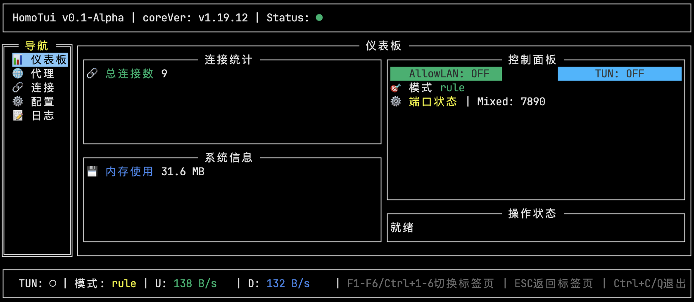

# homoTui - Mihomo的终端UI

使用tview构建的基于go的终端用户界面提供了类似于桌面mihomo程序的现代代理管理体验。

[](LICENSE)
[](https://github.com/FlySky-z/homoTui/stargazers)

[English](README.md) | 简体中文



## 🚀 功能特色

- 🖥️ **现代终端界面** - 使用 `tview` 构建美观界面
- 🌐 **代理管理** - 查看和切换代理节点
- ⚙️ **配置控制** - 支持 TUN 模式和代理模式切换
- 📊 **实时监控** - 流量统计与连接状态
- 📋 **规则管理** - [TODO] 查看和管理代理规则
- 📝 **日志查看** - 实时日志显示与筛选
- 🎨 **多主题支持** - [TODO-可能不做] 可自定义界面主题
- 🖱️ **鼠标支持** - 完全鼠标交互
  - 当前推荐使用鼠标以获得更好体验
  - 键盘快捷键仍在开发中

## 📋 项目状态

当前版本：**开发中**（Alpha）

### 开发进度

- [x] API 客户端开发
- [x] UI 框架搭建
- [x] 核心功能实现
- [ ] 查看配置详情
- [ ] 查看规则
- [ ] 切换配置文件
- [ ] 修改端口

## 🛠️ 技术栈

- **语言**：Go 1.24.1
- **UI 框架**：[tview](https://github.com/rivo/tview)
- **API**：HOMO API

## 📁 项目结构

```
homoTui/
├── main.go                 # 程序入口
├── internal/
│   ├── api/               # API 客户端
│   ├── config/            # 配置管理
│   ├── models/            # 数据模型
│   ├── ui/                # UI 组件
│   │   ├── components/    # 基础组件
│   │   ├── pages/         # 页面组件
│   │   └── utils/         # 工具函数
│   └── app.go             # 应用入口
├── docs/                  # 文档（当前为空）
```

## 🚀 快速开始

### 环境要求

- Go 1.24.1 或更高版本
- 支持 256 色和鼠标的终端

### 安装依赖

```bash
go mod tidy
```

### 运行程序

```bash
go run main.go
```

### 使用方法

1. 启动应用程序
2. 使用鼠标或键盘快捷键进行导航
3. 切换到 `配置` 标签页
4. 配置你的设置
  - 配置数据将保存到 `~/.config/homoTui/config.yaml`
5. 配置完成后，建议保存并重启应用以避免问题
6. 尽情享受 HomoTui！

## 🤝 参与贡献

欢迎提交 Issue 和 Pull Request！

### 开发流程

1. Fork 本项目
2. 创建你的功能分支（`git checkout -b feature/AmazingFeature`）
3. 提交更改（`git commit -m 'Add some AmazingFeature'`）
4. 推送到分支（`git push origin feature/AmazingFeature`）
5. 创建 Pull Request

## 📄 许可证

本项目采用 MIT 许可证，详情请参阅 [LICENSE](LICENSE) 文件。

## 🙏 致谢

- [tview](https://github.com/rivo/tview) - 强大的终端 UI 库

## 📞 联系方式

如有任何问题或建议，请通过以下方式联系我们：

- 问题 [Issue](https://github.com/FlySky-z/homoTui/issues)
